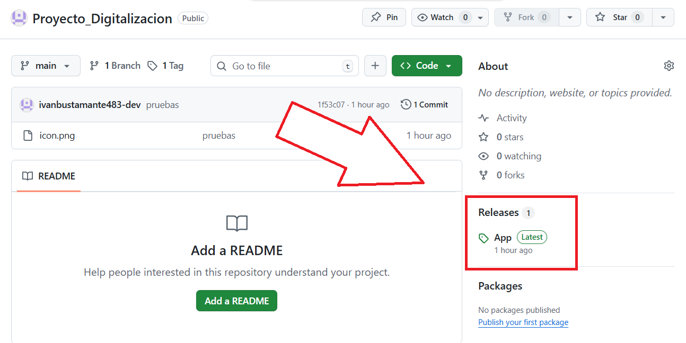
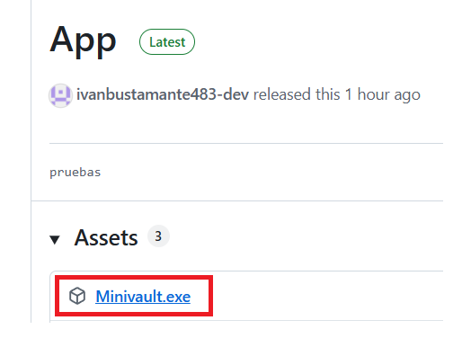
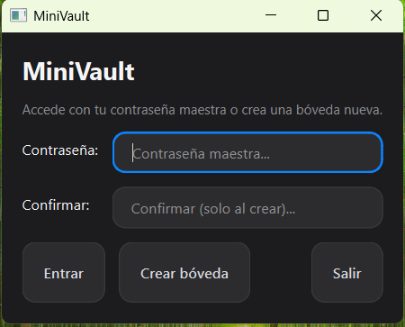
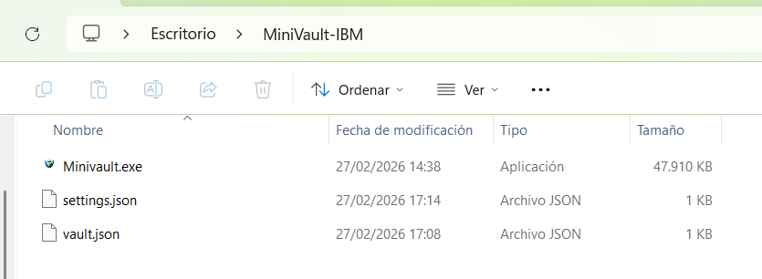

# 🛡 MiniVault

MiniVault es una aplicación de escritorio para guardar contraseñas de forma segura en tu propio ordenador.

- No usa internet  
- No sube datos a ningún servidor  
- Todo se guarda cifrado en tu PC  

---

# 📥 Cómo descargar la aplicación

⚠️ El archivo `.exe` no está en la sección principal del repositorio.

GitHub no permite subir archivos grandes directamente en el código del proyecto (límite 25MB).  
Por eso el ejecutable está en la sección **Releases**, que es donde se suben versiones listas para usar.

---

## 🔹 Paso 1 – Ir a Releases

1. Entra en este repositorio.
2. En la parte derecha verás una sección llamada **Releases**.
3. Pulsa en "App" y descarga el archivo.

---

## 🔹 Paso 2 – Descargar el ejecutable

Dentro de la Release verás un archivo llamado: **MiniVault**

Haz clic en él para descargarlo.

---

# 📂 MUY IMPORTANTE – Crear una carpeta antes de abrirlo

Antes de ejecutar la aplicación:

1. Crea una carpeta nueva en tu Escritorio.
2. Mueve el archivo `MiniVault.exe` dentro de esa carpeta.
3. Ejecuta el archivo desde ahí.

---

## ❓ ¿Por qué es importante usar una carpeta?

Porque la aplicación crea automáticamente dos archivos:

- `vault.json` → donde se guardan tus contraseñas cifradas  
- `settings.json` → donde se guardan tus ajustes  

Si ejecutas el `.exe` suelto (por ejemplo desde Descargas), esos archivos se crearán ahí y pueden perderse o mezclarse con otros archivos.

Tener todo dentro de una carpeta evita:

- Perder tus contraseñas
- Mover el exe y dejar los datos atrás
- Desorden en el ordenador

Esa carpeta es literalmente tu caja fuerte local.

---

# 🚀 Cómo usar MiniVault

---

## 1️⃣ Primer inicio

Al abrir la aplicación por primera vez:

- Te pedirá crear una **contraseña maestra**
- Esa contraseña será la única forma de acceder a tus datos
- No hay recuperación si la olvidas

Después de crearla, se generará tu bóveda cifrada.

---

## 2️⃣ Añadir credenciales

Pulsa:

Introduce:

- Servicio (ej: Gmail)
- Usuario
- Contraseña
- Categoría (opcional)
- Notas (opcional)

Guarda y listo.

---

## 3️⃣ Editar o eliminar

Selecciona una fila y pulsa:

- ✏ Editar  
- 🗑 Eliminar  

---

## 4️⃣ Copiar contraseña

Selecciona una credencial y pulsa:
- Copiar contraseña

La contraseña:

- Se copia al portapapeles
- Se borra automáticamente después de unos segundos (según ajustes)

---

## 5️⃣ Ajustes

En el icono ⚙ puedes:

- Cambiar entre modo claro y oscuro
- Activar auto-bloqueo
- Cambiar tiempo de limpieza del portapapeles
- Ocultar usuarios en la tabla

---

# 🔐 Seguridad

- Las contraseñas se cifran con criptografía fuerte.
- La clave se genera desde tu contraseña maestra.
- Sin la contraseña maestra no se pueden leer los datos.
- La app funciona completamente offline.

---

# 📦 ¿Por qué el archivo está en Releases y no en el código?

GitHub limita el tamaño de archivos que se pueden subir directamente al repositorio (máximo 25MB).

El ejecutable pesa más porque incluye:

- Python
- PySide6 (interfaz gráfica)
- Librerías de cifrado
- Todo empaquetado para que no tengas que instalar nada

Por eso se sube en **Releases**, que es el lugar oficial de GitHub para distribuir aplicaciones listas para usar.

---

# 🖥 Requisitos

- Windows 10 o Windows 11
- No necesitas instalar Python
- No necesitas instalar librerías
- Solo descargar y ejecutar

---

# 📁 Estructura recomendada en tu PC

Después de descargarlo, tu carpeta debería verse así:

---

# 📌 Recomendación final

No borres:

- `vault.json`
- `settings.json`

Ahí están tus datos.

Si cambias de ordenador, copia toda la carpeta completa.

---
